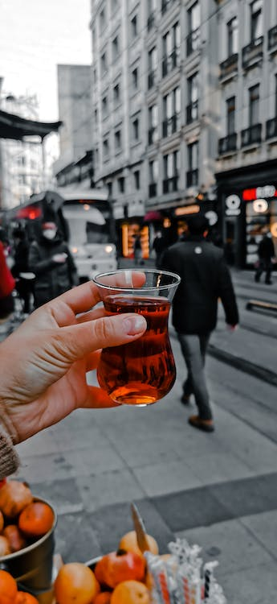
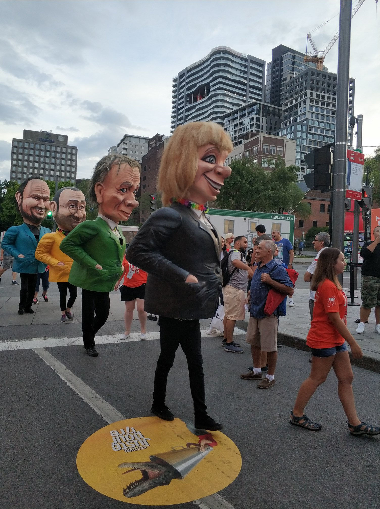

# Türkler ve Mizah

80’li 90’lı yıllarda TRT radyo kanallarının birinde Faruk Yener’in hazırlayıp sunduğu “Her plağın bir öyküsü var” (ilk zamanlarda “Her plağın bir hikayesi var”-dı) başlıklı bir klasik müzik programı vardı. Hem klasik müzik dinletir, hem de dinlettikleri hakkında öyküler, yaşamsal bilgiler, andekdotlar anlatırdı. Anlattıklarının biri de şuydu – 

<!--   -->
&nbsp;&nbsp;&nbsp;&nbsp;  

İtalyan orkestra şefi Arturo Toscanini, anadilinden başka birkaç dili gayet iyi konuşurmuş. “Hangisini konuşmayı tercih edersiniz” diye bir soruya şöyle yanıt vermiş: 
“İş görüşmelerinde İngilizceyi tercih ederim. Birini kızdırmak, korkutmak istediğimde Almanca’ya geçerim. Güzel bir kadınla karşılaştığımda hemen Fransızcaya başlarım. Sabahları aynada traş olurken yüzümü kestiğimde de İtalyanca konuşurum.”

Bu listede Türkçe yok. Ama olsaydı, Toscanini belki şöyle diyecekti – 

“... şakacı, hoşsohbet zaman geçirmek istediğimde Türkçe ... “

Yine çok eskiden, Türkiye’de tek ve en çok satan GırGır mizah dergisi vardı. Herkes Cumartesi gününü bekler, gider GırGır alırdı. Ciltlettirenler, sayılarını kaçirmayanlar, ... . GırGır, yerüstünde en çok satan tüm mizah dergileri içinde ikinci sırada diye haber olmuştu.  Birinci dergi ise, Rusya’da çikan bir dergiydi, ki burada burada Rusya’daki, o zamanki adıyla Sovyet Sosyalist Cumhuriyetler Birliği’ndeki büy-ük orandaki Türkler’i not etmek son derece ilintili ve yerindedir.

Burada (Kanada), “Türk’üm” deyince yüzü aydınlanmayan pek yok. “En sevdiğim ülke” der örneğin biri – gitmiş, görmüş, hayran olmuş. Ki, Türkiye’ye seyahat etmiş Kanadalı, gezip gömüştür. Önce Amerika kıtasini bir gezmiştir, Kuzey Güney hepsi dahil. Çoğu zaman Avrupa’yı gezmiştir, geçmiş/kültürel bağlarıyla ilgili eğilimden dolayı. Türkiye’ye bunlardan sona sıra gelmiştir. Hele önceki zamanlarda “Türkiye’de terör var” ve türevlerini duymuştur, gitmeyi sakıncalı bulmuştur. Ama bir gitti mi cok sever, hem Türkiye’yi, hem de Türkler’i. 

Türkiye’ye gidecek arkadaşlarıma, “Türkler’de çok fazla mizah anlayışı vardır. Ama hemen yüzüstünde görünmez – kişiliklerinin kemikleşmiş bir parcasıdir, yerleşmiş çok derine inmiştir. Eğer bunu keşfedebilirsen, yolculuğun daha da eğlenceli geçer” derim. Bunu söylediğim arkadaşım eğer Türkiye’yi öncesinde zaten gezmiş görmüş biriyse, gözleri kısa bir süre havada boşlukta gezinir gibi hafızasında döner, sonra gülümsemeye başlar. 

Bir meslekdaşım, hemen hepsi Türk olan bir ekipte çalışmaya başlamış ama alışmakta zorlandığını anlatıyordu sürekli. Hele ekiptekilerden birini hiç sevmiyordu, “garip” davranışlarından yakınıyordu. “Söyledikleri herşeyi şaka babında algıla. Hiç bu tür birşeye oturmazsa o zaman ciddi olarak algıla. Ama yine de içinde mutlaka bir miktar şaka vardır” dedim. Sonrasında o karamsar mutsuz bakışı azaldi. Hatta, Türkler’e benzemeye başladı :) Bu sözünü ettiğim, tanıdığımın ekibindeki Türkler’i hiç bilmem – o zaman da, sonrasında da. Duruma/kişiye özel değil yani bu algılarım.

Gezdiğim şehirlerin içinde pek çok renkli metropol var. Bu tam bir karşılaştırma/gözlem olmayacak gerçi. Avrupa ve Kuzey/Orta Amerika dışında hiçbir yeri gezmedım. Özellikle Asya’nın o eski uygarlıklarında kimbilir ne kültürel zenginlikler var. Ama, gezdiklerimin içinde İstanbul kadar ruh derinliği olanı yok. Bunların içinde New York, karşilaştırmadaki ilintisi bakımından belki en yakın – insanları mizaçlarını, herhangi bir en-uçtan (kızgın, kavgaşar, ters, savunmacı, ...) diğer en-uca (hoşgörülü, olumlu, güleryüzlü, içten) bir anda, uçan daire hızıyla değiştirebiliyor. Karşısındakinin bir uçtan diğer uca her türlü mizacını anında görüp algılayabiliyor. Ama, Türkiye’deki, hele İstanbul’daki o alttan alta, ince, yerleşmiş, pekişmiş, artık atmosfere karışmış, soluduğunuz havayla gelir olmuş mizah ve onun verdiği renk yelpazesi yok. Pek cok güzel şehir var bulunmaktan benzersiz zevk alabileceğiniz. Ama, İstanbul gibisi yok. 

Biraz akış dışı, ama yinde de konuyla ilintisi bakımından not düşeceğim. TV reklamları, bir milletin mizah  anlayışını çok güzel yansıtırdı. Reklamcılar, işleri gereği biliyor halk psikolojisini, halka nasıl hitap edeceklerini. Paris’e gittiğimde (ilk yurt dışı çıkışlarımdan biridir) reklamlardaki hareketli, eğlenceli şeyler göze çarpmıştı. Başka bazi yerlerde gereksiz konu sapmaları, hatta basitlik sayılabilecek şeyler. Bazı başka yerlerin reklamları da, örneğin, haber programlarının monotonluğunu anımsatır. 

Mizah, Türk milletinin kişiliğinde çok ayirtedici şekilde vardır ve kişiliğinin çok yerleşmiş, derinde, ayrılmaz bir parçasıdır.  

